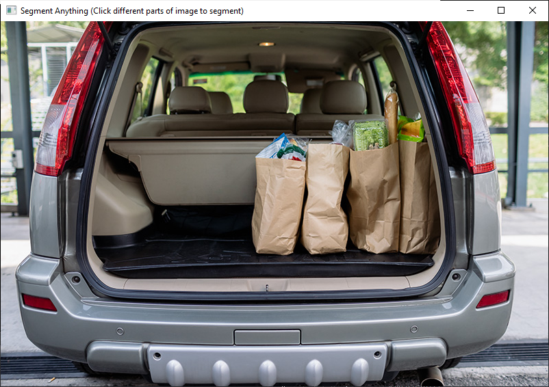
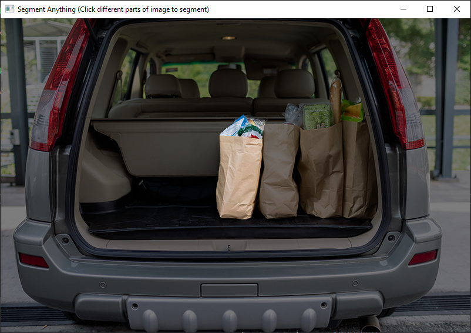

# SamSharp
---
A C# interface for Meta's Segment Anything Model (SAM). This repo contains a small interface project to interact with SAM and get a simple point mask from an image, as well as a small demo project to test mask generation from an image file in an interactive window.

The ImageUtility class uses System.Drawing for image processing, therefore this class is currently only compatable with Windows. Eventually I will migrate this to a cross-platform library if this project gets a full nuget release.

### Generating the Models ###

There are two models needed for this to run

1. <b>Encoder:</b> The encoder needs to be exported from the <i>export_encoder.py</i> script. The PyTorch model will need to be downloaded from either the [Segment Anything repo's](https://github.com/facebookresearch/segment-anything) checkpoints or from [MobileSAM's](https://github.com/ChaoningZhang/MobileSAM/blob/master/weights/mobile_sam.pt) repo for a faster and much lighter model (recommended if your hardware isn't as beefy)
2. <b>Decoder:</b> The decoder model can be generated from the Segment Anything's [Onnx Model Example's](https://github.com/facebookresearch/segment-anything/blob/main/notebooks/onnx_model_example.ipynb) notebook

Once these are generated, select the preprocessor and decoder onnx files when prompted with the file dialog. Then select an image.

Click anywhere to start segmenting

### Unity Compatibility ###

The SamInferenceSession class will work in Unity with all the required DLLs for the [OnnxRuntime](https://www.nuget.org/packages/Microsoft.ML.OnnxRuntime#readme-body-tab) in the project's plugins folder. The ImageUtility class should work as well with required System.Drawing DLLs, but it would be better to have a custom written class that uses Unity's Texture2D at that point.

It also should work with the [Sentis](https://unity.com/products/sentis) package with rewritten classes

